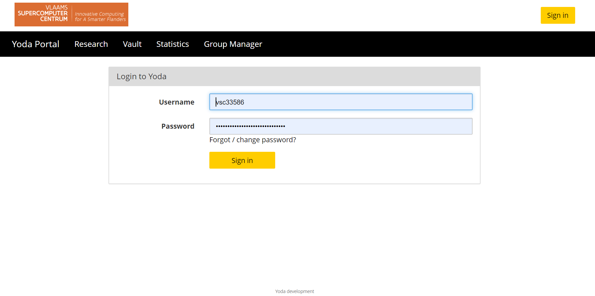
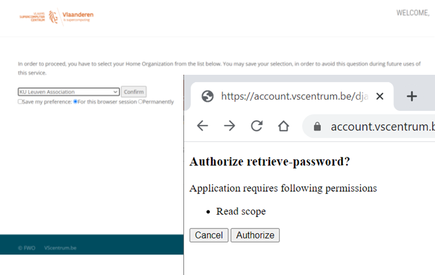
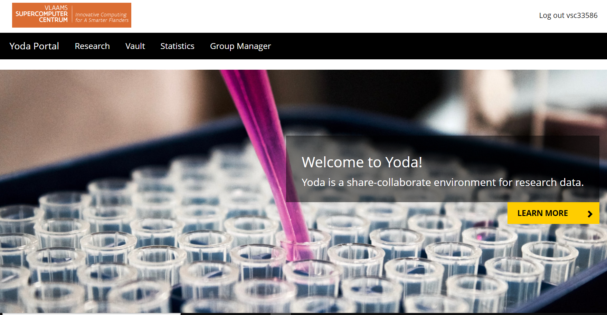

# Yoda Portal Client for VSC Users

*Prerequisites:*  
*-A VSC-account coupled to an iRODS account*  

[Yoda](https://yoda.uu.nl/yoda-uu-nl/what-is-yoda/index.html) is a research data management solution developed by Utrecht University. Yoda portal is a web application for performing data management activities, such as managing access to your data and changing metadata. It allows users to deploy and manage their research data.

You can reach the Yoda portal by clicking [VSC-Yoda]( https://icts-p-hpc-yoda-portal.cloud.icts.kuleuven.be/user/login) login page.

To be able to login the Yoda, we should fill in the username and password fields of “sign in to Yoda” form.

You should enter your iRODS user name in the username field. For password field, you should first obtain a temporary password (valid only for one day) from the account page at [password](https://vsc-passwd.icts.kuleuven.be) address. 

To get the password you can simply log in the mentioned address using your institution account, authorize the application, and copy the obtained password.

In VSC-Yoda portal, there are two main workspaces, “research” and “vault”.

**Research**: Collaboration workspace for a research group. No restrictions on the organization of data in folders. Metadata can be added to a folder. When all required metadata has been added a folder can be archived. You can view/edit/add metadata for a dataset that will be placed in the vault.

VSC users are expected to use mostly this space.

**Vault**: This area has “publish” functionality which VSC users will not use. Tier-1 Data service users will use this area as an output of research area and an input to compute system. It can be also used for short term archiving purposes.

**Group Manager**: To keep data in a secure way Yoda allows you to put the data in data compartments, which can only be accessed by members. The Group Manager can create category/subcategory/group as data compartments and their members. People with a “group manager” role can add members to a data compartment, remove them, and change their roles.

Use the Research menu item to manage your data. Each data compartment has two main folders:

The main folder (“research-…”) contains current research data that researchers collaborate on. Data is kept in subfolders. The subfolders can be organized according to the needs of the researcher.

Use the “Submit” button to deposit the subfolder. This will copy the contents of the subfolder to the Vault folder as a new data package (see below). Before doing so, the subfolder must be described with metadata, which can be entered by clicking on the Metadata button. The folder named “vault-…” contains deposited data packages. Once deposited, data cannot be removed. Therefore the vault can be used to account for data in a research project to comply with FAIR principles.

**Note**: If a collection is created in iRODS, we can see it with its content in Yoda but we cannot edit anything. A collection created first in Yoda can be seen/edited both in Yoda and iRODS.

To allow different communities to share the same Yoda implementation the concept of categories and subcategories were introduced. Every group has a category and subcategory. Within the group-manager groups are grouped into a tree of categories and subcategories. See [category/permission](https://github.com/UtrechtUniversity/yoda/blob/development/docs/design/group-manager.md)

We can do now some hands-on exercises:

**Exercise1**:

- Create the project group
- Give required permission

**Exercise2**:

- Data upload and download through the mapping yoda.
- Upload a data file via the portal.

**Exercise3**:

- Fill in default metadata form and submit it.

**Exercise4**:

- Use the search field options to understand the search.

**Exercise5**:

- Lock one of the collection.
- Submit it for vault.

