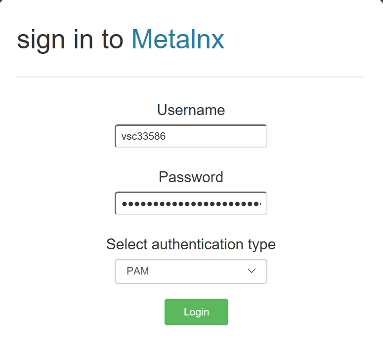
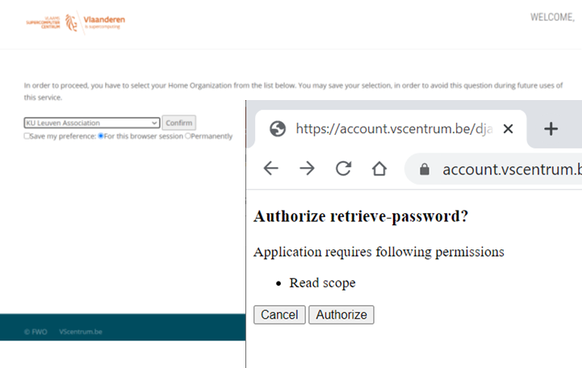
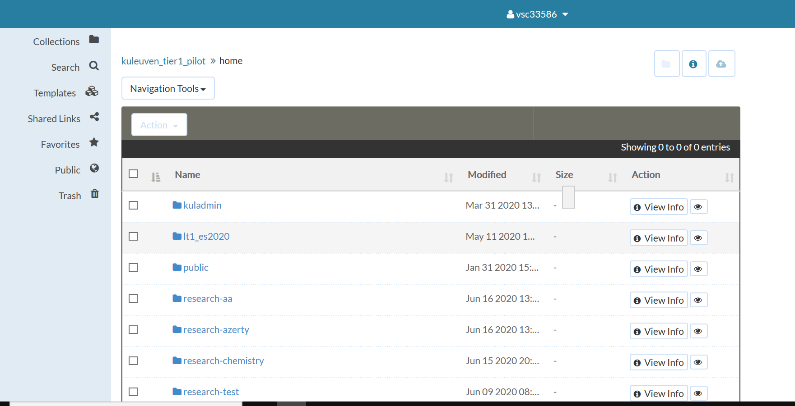

# Metalnx Portal Client for VSC Users

*Prerequisites:*  
*-A VSC-account coupled to an iRODS account*  

Metalnx is a graphical user interface and serves as a client to iRODS. It help simplify most administration, collection management, and metadata management tasks removing the need to memorize the long list of iCommands. It allows users to manage content and metadata associated with content.

Via the following link [Metalnx](https://icts-p-hpc-metalnx.cloud.icts.kuleuven.be/metalnx/login/), we can reach the Matalnx portal. 

To be able to login the system, we should fill in the username and password fields of “sign in to Metalnx” form.

The username should be your iRODS user name. The temporary password (valid only for one day) should be acquired from the account page at [password](https://vsc-passwd.icts.kuleuven.be) address. To get the password you can simply log in the mentioned address using your institution account, authorize the application, and copy the obtained password.

Metalnx portal is mainly composed of two panes. The left pane keeps the relevant tabs of our deployment instance and the right pane provides us with the selected tabs’ functionalities.

**Collections**: Under this tab, we can perform all data object (= a file) and collection related activities
 
- Uploading files  
- Moving files/collections  
- Copying files/collections  
- Renaming files/collections  
- Applying metadata templates (see later)  
- Downloading files  

Behind any collection or file, you can press 'View info' for the following options:

- Adding metadata to files/collections  
- Adding files/collections to favorites  
- Setting permissions  
- Getting previews of files  

This tab and its functionalities are mostly used in Metalnx.

**Search**: This tab gives search options based on the metadata and properties parameters (currently not available).

**Templates**: We can here create our own metadata templates or import a template from outside in a json format. These can then be applied to files or collections.

**Shared Links**: Here you can see the links shared by other users.

**Favorites**: Here you can see your bookmarked collections and files.

**Public**: here you can reach the public area collections.

**Trash**: Here you can see the files and collections moved to trash bin.

Now let’s do some hands-on exercises:

**Exercise 1: data objects, folders and metadata**:

- Create a metalnx_test collection under your home directory.
- Upload a file inside the collection.
- Add one metadata AVU to the this uploaded file. (Attribute: Author, Value: your name).  
- Rename your file to 'testfile'.
- Download testfile to your local machine.

 **Exercise 2: metadata templates**:

- Create one public metadata template with the name of “test_training” and it has to include at least two AVUs.
- Create one private metadata template with the name of your choose.
- Add the private one on the metalnx_test collection.
- Add one of the public metadata template on the metalnx_test collection.

Take a look at the metadata of your collection and your uploaded file. As you can see, we can easily manage metadata on both collections and the files in them, even if they have different metadata.

**Exercise 3: favorites and sharing**:

- Add metalnx_test collection to your favorites.
- Give “own” access permission to a friend and share this file link.
- Check your shared tab if there are any files shared with you. (If not, ask me to share with you one.)

**Exercise4: deleting**:
- Delete your file.
- Delete metalnx_test collection.
- Go to the trash tab and look at your deleted items.
- Permanently delete the deleted file.
- Move the deleted collection metalnx_test to the public collection.

As you have seen we can do lots of data management operations easily with the Metalnx portal.

